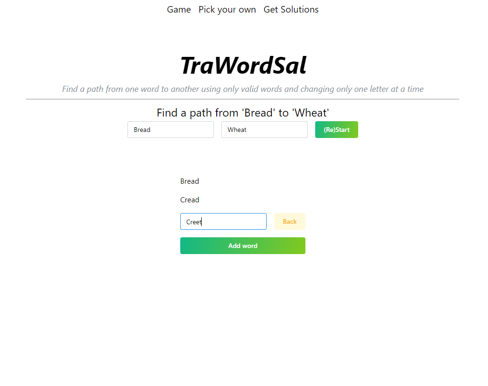

# TraWordSal

A solver for traversing from one word to another across valid words while only changing one letter
at a time.

Example: Going from "Hand" to "Bank" would be [Hand -> Band -> Bank]

### Credits

* `words_alpha.txt` by [DWYL](https://github.com/dwyl/english-words) (local copy has some bad words
  removed)
* `deutsch.txt` by [gwicks](http://www.gwicks.net/dictionaries.htm)  (local copy has some bad words
  removed)